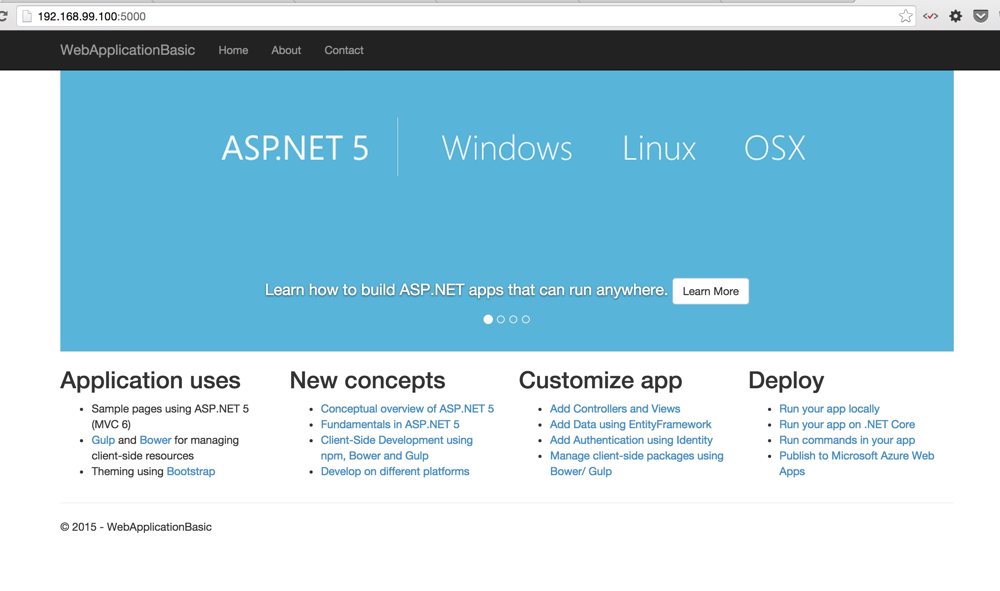
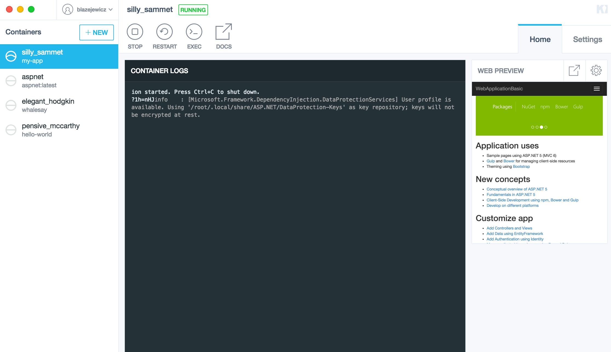

# Note

The Docker configuration file support has been added to `generator-aspnet`:

https://github.com/OmniSharp/generator-aspnet/commit/a7250e6010f41f5f46987ebb9a6cd63f1f455510

# Docker file for generator-aspnet

The Docker file based on https://github.com/aspnet/aspnet-docker that is tested to work with `generator-aspnet` and Docker on Docker 1.8.* - tested on Mac OS X 10.10.*.

@blazejewicz
