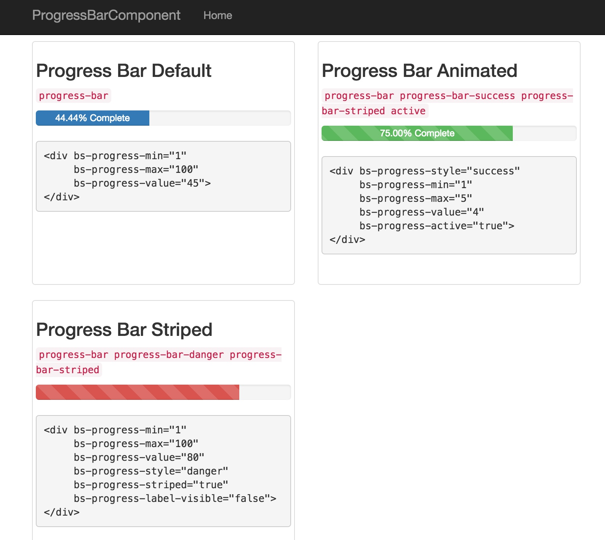

# Bootstrap ProgressBar component TagHelper

> In the last few blog posts, I have spent some time covering the tag helpers that are built in to MVC 6. While the built in tag helpers cover a lot of functionality needed for many basic scenarios, you might also find it beneficial to create your own custom tag helpers from time to time.

In this post, I will show how you can easily create a simple tag helper to generate a Bootstrap progress bar.

[Creating custom MVC 6 Tag Helpers](http://www.davepaquette.com/archive/2015/06/22/creating-custom-mvc-6-tag-helpers.aspx)  
[Dave Paquette](http://www.davepaquette.com/archive/author/davepaquette)

## Changes compared to original article

* more feature-completed tag helper so ProgressBar can have different context styles
* C# 6 multiline string interpolation is used instead of C# `string.Format`
* More examples provided

## Author

The original example this source is based on:

[Creating custom MVC 6 Tag Helpers](http://www.davepaquette.com/archive/2015/06/22/creating-custom-mvc-6-tag-helpers.aspx)  
[Dave Paquette](http://www.davepaquette.com/archive/author/davepaquette)
