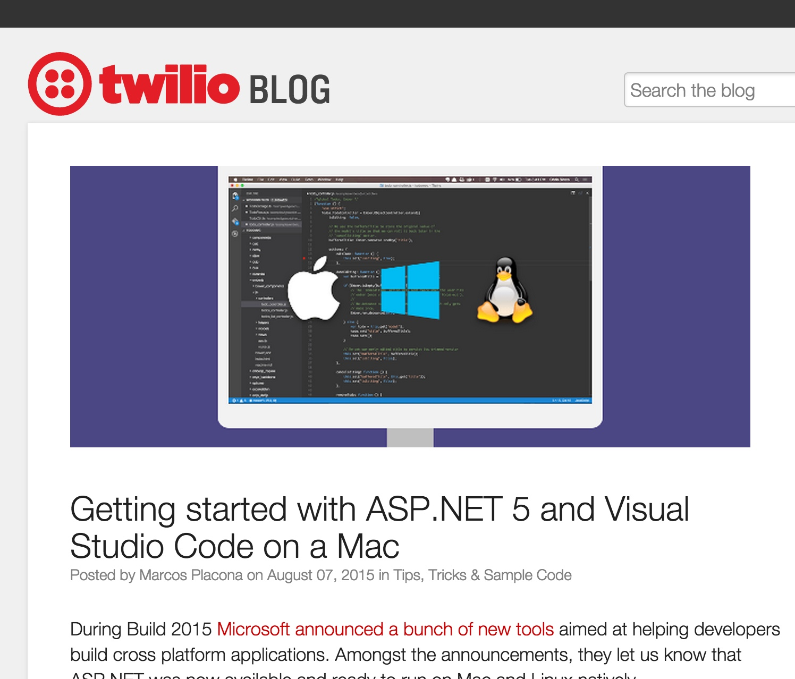
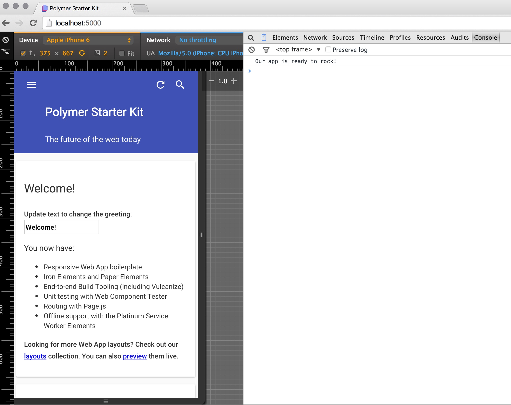

# ASP5 MVC6 Examples

Various resources for developers kept together into a single, frequently updated examples.

The examples are based on many different resources, like posts from Microsoft Developers Evangelists, bloggers, etc. The examples are kept updated to most recent version of [ASP.NET 5](http://docs.asp.net/en/latest/conceptual-overview/aspnet.html).

## Examples

### MongoMvc: Building Web API using MVC 6 & MongoDB

> This is a quick walkthrough on using ASP.NET 5 to build a Web API layer using MongoDB. The overall concept is not too dissimilar from previous examples you may have seen using X type of database, however there are some areas covered that are either new in MVC 6 that you may find you didn't know are there.

**Author**: Shayne Boyer
**Original article**: [http://tattoocoder.azurewebsites.net/building-vnext-web-api-using-mvc-6-mongodb-azure/](http://tattoocoder.azurewebsites.net/building-vnext-web-api-using-mvc-6-mongodb-azure/)

### Twilio Call Console Log Application

[Twilio Blog](https://www.twilio.com/blog/2015/08/getting-started-with-asp-net-5-and-visual-studio-code-on-a-mac.html)
> How to get started with setting up your .NET development environment on a Mac running Yosemite and show you how to build a Console and an ASP.NET MVC 6 call log application using Visual Studio Code and ASP.NET 5.

### Polymer Starter Kit Mvc

A simple implementation of light version of Polymer Starter Kit with `beta6` based Web Application Basic template MVC6 project:

**Author**: Peter Blazejewicz

## Compilation Author
@peterblazejewicz
