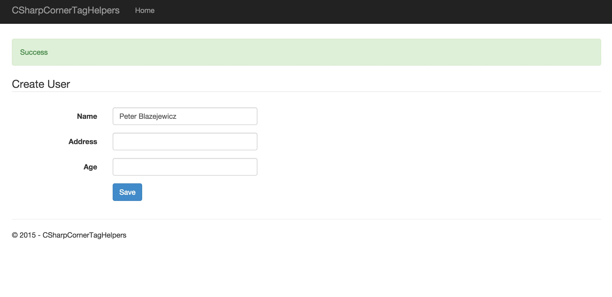

# ASP5 MVC6 Examples

Various resources for developers kept together into a single, frequently updated examples.

The examples are based on many different resources, like posts from Microsoft Developers Evangelists, bloggers, etc. The examples are kept updated to most recent version of [ASP.NET 5](http://docs.asp.net/en/latest/conceptual-overview/aspnet.html).

## Examples

### MongoMvc: Building Web API using MVC 6 & MongoDB

> This is a quick walkthrough on using ASP.NET 5 to build a Web API layer using MongoDB. The overall concept is not too dissimilar from previous examples you may have seen using X type of database, however there are some areas covered that are either new in MVC 6 that you may find you didn't know are there.

**Author**: Shayne Boyer
**Original article**: [http://tattoocoder.azurewebsites.net/building-vnext-web-api-using-mvc-6-mongodb-azure/](http://tattoocoder.azurewebsites.net/building-vnext-web-api-using-mvc-6-mongodb-azure/)

### ASP.NET MVC 6, Part 1: Tag Helpers

> the new Tag Helpers feature that can be used to clean up your Razor views.

[Clean up your Razor views with the new tag helpers in ASP.NET MVC 6](https://visualstudiomagazine.com/articles/2015/08/04/asp-net-mvc-6-part-1-tag-helpers.aspx)

**Author**: Eric Vogel

### Bootstrap ProgressBar component TagHelper

> In the last few blog posts, I have spent some time covering the tag helpers that are built in to MVC 6. While the built in tag helpers cover a lot of functionality needed for many basic scenarios, you might also find it beneficial to create your own custom tag helpers from time to time.

In this post, I will show how you can easily create a simple tag helper to generate a Bootstrap progress bar.

[Creating custom MVC 6 Tag Helpers](http://www.davepaquette.com/archive/2015/06/22/creating-custom-mvc-6-tag-helpers.aspx)  
[Dave Paquette](http://www.davepaquette.com/archive/author/davepaquette)

### Twilio Call Console Log Application

[Twilio Blog](https://www.twilio.com/blog/2015/08/getting-started-with-asp-net-5-and-visual-studio-code-on-a-mac.html)
> How to get started with setting up your .NET development environment on a Mac running Yosemite and show you how to build a Console and an ASP.NET MVC 6 call log application using Visual Studio Code and ASP.NET 5.

### Polymer Starter Kit Mvc

A simple implementation of light version of Polymer Starter Kit with `beta6` based Web Application Basic template MVC6 project:

**Author**: Peter Blazejewicz

### TODO/WIP
* http://stephenwalther.com/archive/2015/01/12/asp-net-5-and-angularjs-part-1-configuring-grunt-uglify-and-angularjs
* TwillioMakeAndReceiveCalls

## Compilation Author
@peterblazejewicz
