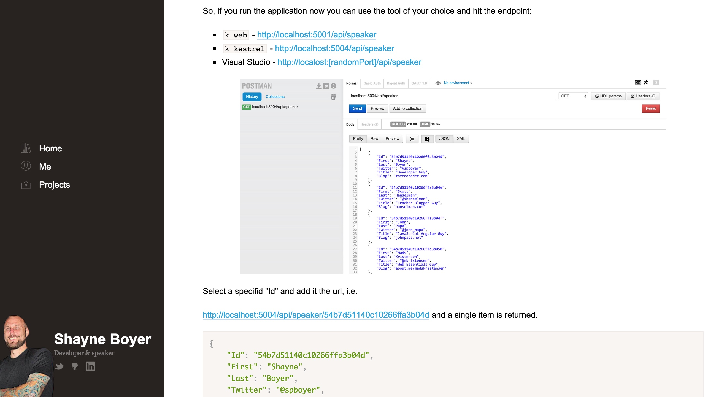

# ASP5 MVC6 Examples

Various resources for developers kept together into single, frequently updated examples

The examples are based on many different resources, like posts from Microsoft Developers Evangelists, bloggers, etc. The examples are kept updated to most recent version of [ASP.NET 5](http://docs.asp.net/en/latest/conceptual-overview/aspnet.html).

## Examples

### MongoMvc: Building Web API using MVC 6 & MongoDB

> This is a quick walkthrough on using ASP.NET 5 to build a Web API layer using MongoDB. The overall concept is not too dissimilar from previous examples you may have seen using X type of database, however there are some areas covered that are either new in MVC 6 that you may find you didn't know are there.

**Author**: Shayne Boyer  
**Original article**: [http://tattoocoder.azurewebsites.net/building-vnext-web-api-using-mvc-6-mongodb-azure/](http://tattoocoder.azurewebsites.net/building-vnext-web-api-using-mvc-6-mongodb-azure/)

## Compilation Author
@peterblazejewicz
