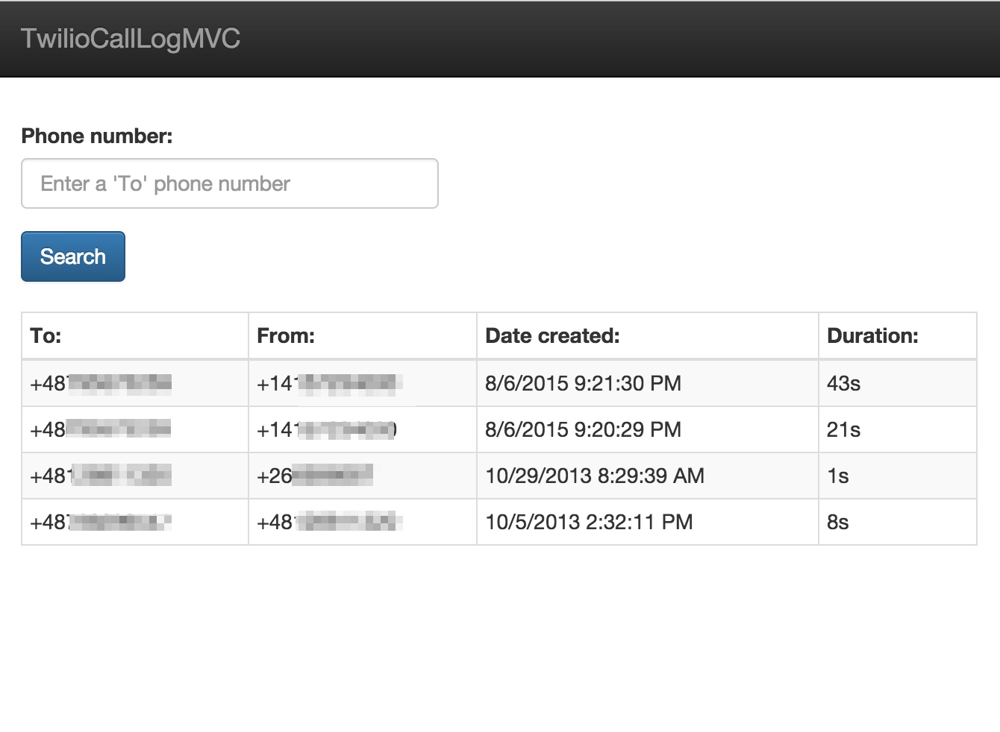

# Twilio Call Log MVC

This project is based on MVC project described in [Getting started with ASP.NET 5 and Visual Studio Code on a Mac](https://www.twilio.com/blog/2015/08/getting-started-with-asp-net-5-and-visual-studio-code-on-a-mac.html).




## Description

The project contains some modification compared to original blog post source code:

* the project file is modified to not use `dnxcore50` as Twilio package dependencies does not yet support it
* the project is using `Configuration` to streamline application configuration: https://github.com/aspnet/Configuration
* some syntax is updated to C# v6 (like string interpolation)
* The `config.json` contains only template data. You could add your information there as per article information taking these bits from your Twilio dashboard. Instead of `config.json` keys th ectual code relies on `user-secret` tool.
* the MVC project uses updated Bower and Gulp implementation as it runs in 'Development' mode by default (due to settings in `project.json`)

```bash
➜  TwilioCallLogConsole git:(master) ✗ dnx . restore
➜  TwilioCallLogConsole git:(master) ✗ dnx . build
➜  TwilioCallLogConsole git:(master) ✗ dnx . kestrel
```

## User Secrets

https://github.com/aspnet/Home/wiki/DNX-Secret-Configuration

>  a user secrets configuration system which is designed to store development configuration values in a location that's outside of your projects source tree. The user secrets configuration system comes in two parts, a global tool and a ConfigurationSource. The global tool allows you to manage secrets (add, remove, list) whilst the ConfigurationSource adds the values stored into the configuration system so that you can pass them to whatever APIs require them.

When configuration for Twilio is moved outside of project the code in `Project.cs` does not require any change. If we don't provide secrets via `AddUserSecrets()`, the keys from `config.json` are used. You can also pass them as environment variables:

```
➜ dnu install SecretManager
➜ user-secret set AccountSid AC4e2c0434f43d9155ed52f1084xxxxxx
info: Successfully saved AccountSid = AC4e2c0434f43d9155ed52f1084xxxxxx to the secret store.
➜ user-secret set AuthToken 2b9374e10f5c70cae75478d7xxxxxx
info: Successfully saved AuthToken = 2b9374e10f5c70cae75478d7xxxxxx to the secret store.
```

```
➜ user-secret list
info: AccountSid = AC4e2c0434f43d9155ed52f1084xxxxxx
info: AuthToken = 2b9374e10f5c70cae75478d7xxxxxx
```

## Author

* Marcos Placona
* https://www.twilio.com/blog/author/marcos
